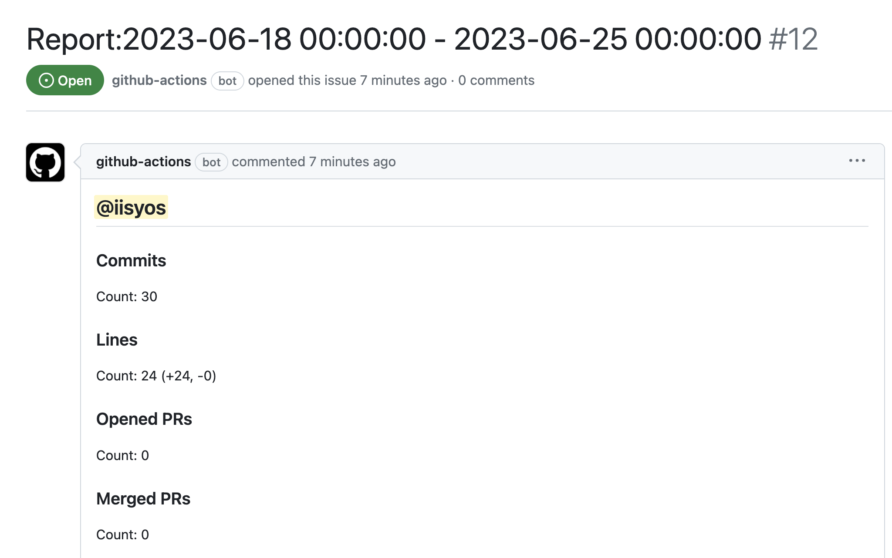

## github-contribution-metrics

This Repository is GitHub Actions package that summary git activity per contributor. 
Using [schedule](https://docs.github.com/en/actions/using-workflows/events-that-trigger-workflows#schedule) event is recommended. 

## Usage
Install this package to your repository under format.
It's all you need to do!

```yml
name: Report Git Activity

on:
  schedule:
    - cron: '0 0 * * 1' # every Monday

jobs:
  main:
    runs-on: ubuntu-latest
    steps:
    - uses: actions/checkout@v2
    - name: Publish Report
      uses: iisyos/github-contribution-metrics@main
      env:
        TOKEN: ${{ github.token }}
```

Then, github-actions bot publish issue like this.


## License

[MIT](https://choosealicense.com/licenses/mit/)

## Contributing
I welcome your issue or pull request from anyone.
If you have any questions, please feel free to ask me!

## Notice
I assume committer and author are same name.
If you'er using different name, maybe the count is not correct.
